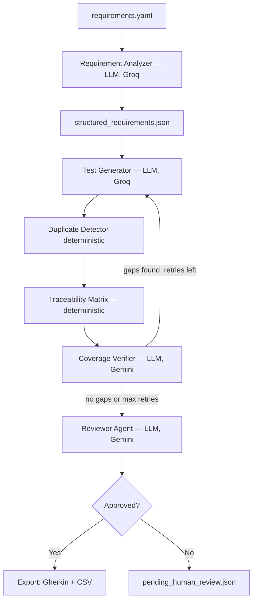

# AI Test Case Generator

A LangGraph-based multi-agent pipeline that turns a raw software requirement into reviewed, traceable QA test cases — exported as Gherkin (BDD) and CSV. Built as a portfolio project translating a year of Guidewire PolicyCenter/BillingCenter QA experience into an AI engineering system, not a generic LLM wrapper.

The core idea: an LLM generating test cases isn't interesting on its own. What's interesting is a **generate → verify → retry loop with a deterministic stop condition**, a **traceability matrix that makes "coverage" a checkable claim instead of an LLM assertion**, and a **quality gate reviewed by a different model family** — the same rigor a real QA process demands, applied to an agentic system.

## Architecture



**Requirement Analyzer** — one LLM call per raw requirement. Extracts feature name, actor, preconditions, main flow, inputs, expected outcomes, business rules, acceptance criteria, and flagged ambiguities into structured JSON.

**The loop** — Test Generator (Groq, Model A) → Duplicate Detector → Traceability Matrix → Coverage Verifier (Gemini), repeating with gap-targeted retries until coverage is met or a retry cap is hit. Never unbounded.

**Duplicate Detector** — deterministic, zero LLM cost. Embeds each test case (`sentence-transformers`) and clusters by cosine similarity. No reason to spend a model call on something plain code does reliably.

**Traceability Matrix** — deterministic, zero LLM cost. Maps `business_rules → linked test cases`, flags uncovered rules. This is what makes "coverage" auditable instead of a vibe.

**Coverage Verifier** — the one legitimate LLM call in this stage, and scoped narrowly: it only judges rules that already have ≥1 linked test case, checking whether the test actually exercises the rule's substance (not just whether a link exists). Uncovered rules skip straight to the gap list — no LLM needed to know something's missing.

**Reviewer Agent** — a genuinely different model family (Gemini) from the Generator (Groq/Llama), specifically to avoid self-preference bias when critiquing generated output. Runs once, after the loop exits, as a final gate — not part of the retry loop.

**Export** — pure code. Only Reviewer-approved test suites get exported to Gherkin/CSV; flagged ones are held in `pending_human_review.json` pending a human decision, not silently shipped or silently dropped.

## Design decisions worth knowing the "why" on

- **Test IDs are assigned in code, never trusted from the model** — avoids ID collisions across retries and fixtures.
- **Duplicate detection runs before the traceability matrix, every pass** — a coverage report built before dedup can reference test cases that get deleted a step later.
- **`covered_rule_ids` persists across loop iterations** — already-adequate rules are never re-sent to the Coverage Verifier, so retries cost API calls proportional to remaining gaps, not total rule count.
- **Two categories of output files** — snapshots (`test_cases.json`, `review_results.json`) reflect only the latest run; the trail (`pipeline_runs.json`, `duplicates_removed.json`) appends across runs with a `run_id`, so coverage/quality trends over time are inspectable, not just the current state.
- **Reviewer rejection is a quality signal, not a pipeline failure** — a run can complete successfully while specific fixtures get flagged and held for human review. Export enforces that gate; nothing ships un-approved.
- **CI regression is manually triggered, not run on every push** — the suite makes real Groq and Gemini calls across every fixture with real retries; running it on every commit would burn free-tier rate limits fast. A deliberate trade-off, not an oversight.

## Tech stack

Python · LangGraph · LangChain · Groq (`llama-3.3-70b-versatile`) · Google Gemini (`gemini-3.5-flash-lite`) · `sentence-transformers` (`all-MiniLM-L6-v2`) · scikit-learn · PyYAML · GitHub Actions

## Project structure

```
requirements.yaml              # raw requirement fixtures (input)
requirement_analyzer.py        # Stage 1: raw requirement -> structured JSON
testgenerator.py               # Test Generator LLM call
dedup.py                       # deterministic duplicate detection
traceability.py                # deterministic coverage matrix
coverage_verifier.py           # LLM adequacy judgment
reviewer.py                    # final quality gate, different model family
graph.py                       # LangGraph StateGraph — orchestrates the full loop
export.py                      # Gherkin + CSV export, gated on Reviewer approval
utils.py                       # shared: any-model response parsing, safe file I/O
run_pipeline.py                # single command: analyzer -> graph -> export
create_baseline.py             # freezes current good output as CI golden baseline
regression_check.py            # re-runs pipeline against golden baseline, flags regressions
golden/                        # frozen baseline (structured_requirements, test_cases, summary)
exports/                       # generated .feature and .csv output
.github/workflows/             # CI regression workflow (manual trigger)
```

## Running it

```bash
pip install -r requirements.txt
# create a .env with GROQ_API_KEY and GOOGLE_API_KEY

python run_pipeline.py
```

This runs the full pipeline end to end: Requirement Analyzer → LangGraph loop (generate/dedup/matrix/verify/review) → Export. Output lands in `test_cases.json`, `review_results.json`, `pipeline_runs.json`, and `exports/`.

To set up regression testing:
```bash
python create_baseline.py      # run once, after manually verifying output is correct
python regression_check.py     # re-run any time to check for regressions
```

## Known limitations / not yet built

- No FastAPI/React layer yet — currently script-first. The pipeline logic (`run_full_pipeline`, `write_pipeline_outputs`) is already factored as importable functions specifically so an API layer can call it directly when built.
- Input is currently a structured `requirements.yaml`; no PDF/doc ingestion.
- Batch/multi-requirement LLM calls were considered and deliberately rejected for v1 — kept one-requirement-per-run for cleaner loop semantics and easier error isolation, at the cost of more total API calls. See commit history / design notes for the trade-off analysis.
